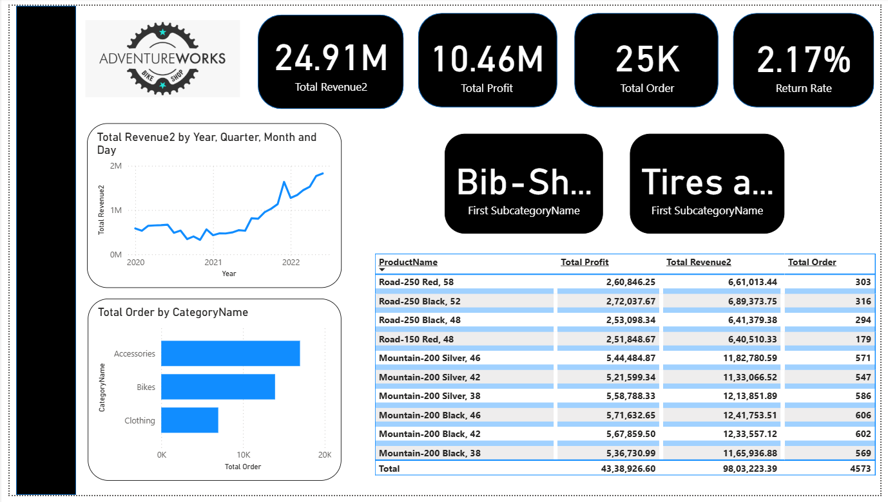
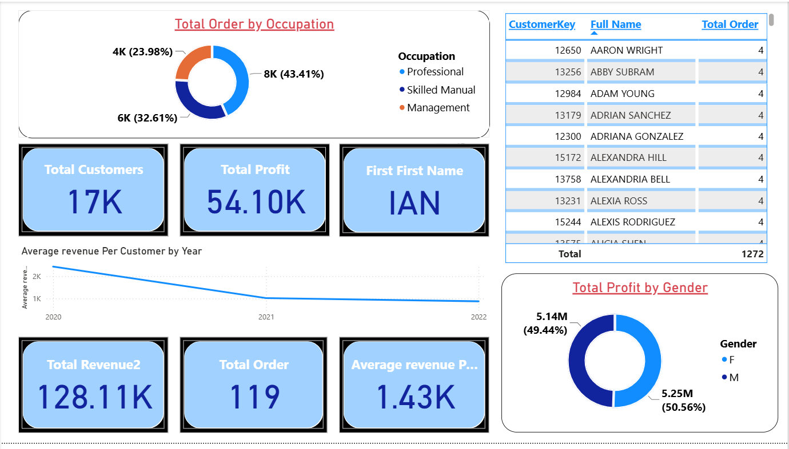

# 📊 AdventureWorks Sales Analytics Dashboard

An interactive **Power BI dashboard** built using the **AdventureWorks** dataset to analyze sales performance, customer behavior, product profitability, and key business metrics. The dashboard enables users to monitor KPIs, identify trends, and gain actionable insights through interactive visualizations.

---

## 🚀 Dashboard Preview

### 📈 Sales Overview



### 👥 Customer Analysis



---

## 🎯 Project Objectives

* Analyze sales performance across different product categories and time periods.
* Monitor key business metrics including revenue, profit, orders, and return rate.
* Understand customer demographics and purchasing behavior.
* Identify high-performing products and customer segments.
* Support data-driven decision-making through interactive dashboards.

---

## 📌 Key Performance Indicators (KPIs)

* 💰 Total Revenue
* 📈 Total Profit
* 📦 Total Orders
* 🔄 Return Rate
* 👥 Total Customers
* 💵 Average Revenue per Customer

---

## 📊 Dashboard Features

### 📈 Sales Dashboard

* Revenue and profit trend analysis
* Orders by product category
* Product-wise revenue and profitability
* Return rate monitoring
* Interactive KPI cards and filters

### 👥 Customer Dashboard

* Customer demographic analysis
* Revenue by occupation
* Profit distribution by gender
* Customer segmentation
* Average revenue per customer

---

## 💡 Business Insights

* Identified top-performing product categories based on revenue and profitability.
* Analyzed customer demographics to understand purchasing patterns.
* Tracked revenue and profit trends to evaluate business performance over time.
* Monitored return rates to assess product performance and customer satisfaction.
* Enabled interactive filtering for faster exploration of business metrics.

---

## 🛠️ Tech Stack

* **Power BI**
* **DAX**
* **Power Query**
* **Data Modeling**
* **AdventureWorks Dataset**

---

## 📈 Skills Demonstrated

* Data Cleaning & Transformation
* Data Modeling
* Exploratory Data Analysis (EDA)
* Data Visualization
* Dashboard Development
* KPI Reporting
* Business Intelligence
* DAX Calculations
* Interactive Reporting

---

## 📂 Repository Structure

```text
AdventureWorks-Sales-Dashboard/
│
├── AdventureWorks Dashboard.pbix
├── Dashboard_Page1.png
├── Dashboard_Page2.png
└── README.md
```

---

## ⭐ Key Learning Outcomes

* Developed an end-to-end interactive Power BI dashboard using the AdventureWorks dataset.
* Created reusable DAX measures for KPI reporting and business analysis.
* Applied data modeling techniques to establish relationships between tables.
* Designed dashboards that communicate business insights through effective visualizations.
* Strengthened practical skills in Business Intelligence and data storytelling.
